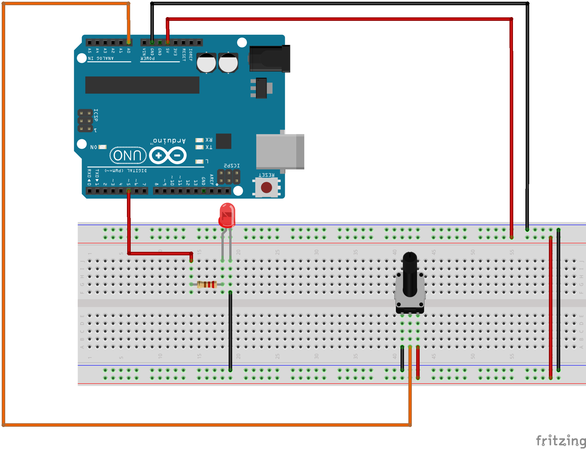

# 02 - Dim a LED with a Potentiometer

A simple arduino program that can be used to DIM a LED with the help of a Potentiometer.

## Schematics

## Components

- Arduino Uno R3

- Breadboard

- 9x M-M wires

- 1x Red LED

- 1x 220 ohm resistors

- 1x 10k Potentiometer
